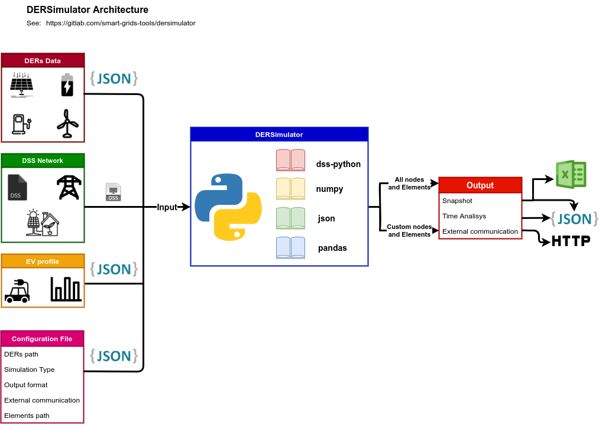
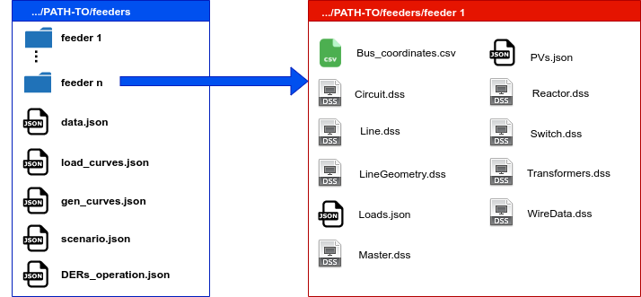

# Distributed Energy Resources (DERs) Simulator and measurements

## Introduction

A program in Python that determines the state of grid operation with distributed Energy Resources (DERs).

The DERs that can be simulated in the program are:

- Charging Stations (CS);
- Photovoltaic Systems (PS);
- Battery Energy Store System (BESS);

The load flow is run through the [dss-python](https://pypi.org/project/dss-python/) library <a href="#ref1">[1]</a>.

## Architecture

**Figure 1:** DERSimulator Architecture

## Installation

_In Construction_

## Simulation Guide

To perform the simulations you need to edit the json file `config.json`, the folder with the distribution network data and the existing DERs.

The configuration file is in json format and has the following main keys: _DSS_ , _Simulation_ , _DERs_ and _Results_. For each of these keys there is a dictionary with the parameters needed to perform different simulations.

### Contents of the file config.json

**Table 1:** Configuration dictionary for the _DSS_ key
| key | key values |
| ------ | ------ |
| PATH | string with the path to the folder containing the feeders. |
| feeders | a list with the names of the folders containing the feeders' data. |
| Loads file name | 
string with the names of the json files that contain the circuit load data. For each feeder folder, you must have the same file name. "None" if there is no file
 |
| PVs file name | 
string with the names of the json files that contain the circuit generation data. For each feeder folder, you must have the same file name. "None" if there is no file
  |
| Load curves | 
string containing the path to the json file with the demand multiplier curves for time-series analysis. The same file should be used for all loads of all feeders. "None" if there is no file. 
|
| PV curves | 
string containing the path to the json file with the generation multiplier curves for time-series analysis. The same file should be used for all loads of all feeders. "None" if there is no file. 
|

**Table 2:** Configuration dictionary for the _Simulation_ key
| key | key values |
| ------ | ------ |
| Type | 
 Type of simulation (snapshot or time-series). Snapshot considers only a single simulation and time-series considers a time variation according to the load, generation and DERs operation curves. 
 |
| Output format | 
 Data output format (json or dataframe). The dataframe (csv) output format is only possible in snapshot simulations. 
 |
| Datetime | 
 Starting time of the simulation. Used to make simulations over time. 
 |
| Time step | 
 Simulation time step in minutes. 
 |
| Samples | 
 Total number of samples. 
 | 

**Table 3:** Configuration dictionary for the _DERs_ key

| key | key values |
| ------ | ------ |
| Scenario | 
String containing the path to the json file with the data for all the DERs. "None" if there is no file.                                  
 |
| Operation | 
String containing the path to the json file with the DER operation. "None" if there is no file.                                  
 |

**Table 4:** Configuration dictionary for the _Results_ key

| key | key values |
| ------ | ------ |
| Scenario | 
String with the path to the json file containing the nodes and elements that should appear in the output file. Enter "All" to display all. Note: Although they are separate, the json file must be the same for the nodes and elements.
|
| Operation | 
String with the path to the json file containing the elements and elements that should appear in the output file. Enter "All" to display all. Note: Although they are separate, the json file must be the same for the nodes and elements.
|

### Input Files

Fig. 2 shows an example of input file organization. It is suggested that the files be in the same folder as shown in the figure.

The directories _feeder 1_ to _feeder n_ contain the DSS files of the network and json files of the PV loads and generations.

**Figure 2:** Suggested folders and files organization for simulation

In the `config.json` file you must pass the paths to the json files, if needed. These files have the following functions:

* `data.json`: Contains the elements to obtain the values of the physical quantities.

* `load_curves.json`: Contains the load curves for the load file;

* `generation_curves.json`: Contains the generation curves for the generation file;

* `scenario.json`: Contains the DERs data;

* `DERs_operation.json`: Contains the operation DERs state at each time step.

## Examples

The examples are downloaded with the repository and using IEEE test cases <a href="#ref1">[2]</a>. Details are at the following links:

[Example 1](https://gitlab.com/smart-grids-tools/dersimulator/-/tree/main/examples/ex1): Snapshot simulation of the IEEE 4-bus network;

[Example 2](https://gitlab.com/smart-grids-tools/dersimulator/-/tree/main/examples/ex2): 96-sample time-series simulation of IEEE 4-bus network;

[Example 3](https://gitlab.com/smart-grids-tools/dersimulator/-/tree/main/examples/ex3): 96-sample time-series simulation of the 4-bus IEEE grid with photovoltaic generation;

[Example 4](https://gitlab.com/smart-grids-tools/dersimulator/-/tree/main/examples/ex4): 96-sample time-series simulation of the IEEE 4-bus network with charging station;

## References

<a name="ref1">[1]</a> dss-python. Available at https://pypi.org/project/dss-python 

<a name="ref2">[2]</a> IEEE test cases. Available at https://github.com/tshort/OpenDSS/tree/master/Distrib/IEEETestCases 

## Observations: 

Icons made by <a href="https://www.flaticon.com/authors/wanicon" title="wanicon">wanicon</a> from <a href="https://www.flaticon.com/" title="Flaticon">www.flaticon.com</a>

